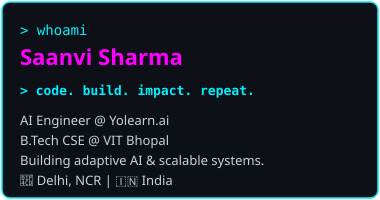
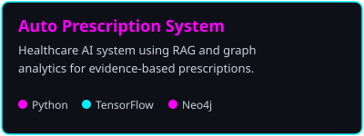
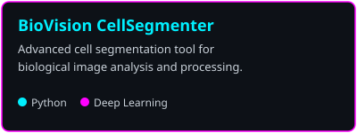
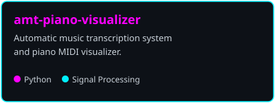

<!-- Header -->

<!-- Top Section -->
  

 

#### &gt; missions --pinned

   

  <a href="https://github.com/confusedjpeg?tab=repositories" style="color:#00F0FF; text-decoration:none;">&gt; view_all_missions -&gt; github.com/confusedjpeg?tab=repositories</a>

 

#### &gt; tech_stack --loaded

       

 

#### &gt; connect --links

  

 
 

---

  &gt; system.status 
  missions_running = true | bugs_crushed = infinite | coffee_level = 87% | focus_mode = ON 
  &gt; }_

